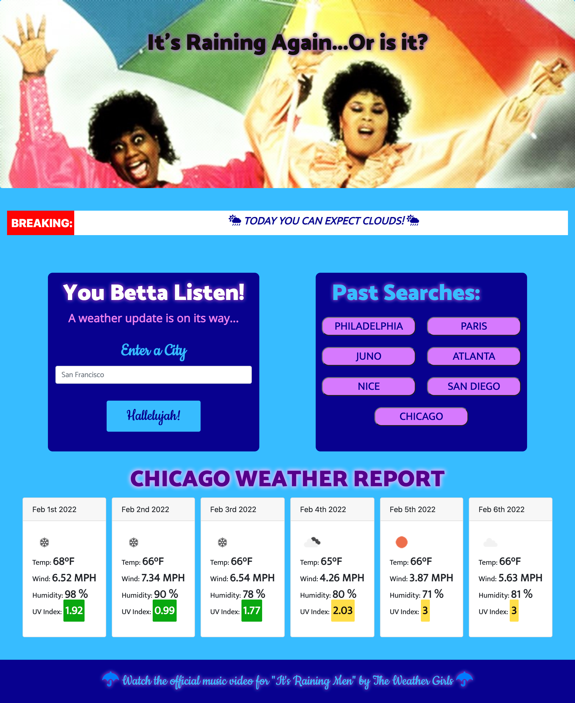

# It'a Raining Again...Or Is It? -- Weather App

We're your Weather Girls and have we got news for you! You betta listen -- We have a new weather app to put all your weather worries to rest. We might not be able to help with your love life (this time) but until that miracle blesses our skies again, we have just the thing for all your climate quandaries.

## Table of contents
* [Technologies](#technologies)
* [Mockup](#mockup)
* [Resources-used](#resources-used)
* [Possible-improvements](#possible-improvements)
* [Github-url](#github-url)
* [Deployed-url](#deployed-url)

## Technologies

This website was built from scratch using HTML, CSS, JavaScript, Bootstrap, and Love, Honey!

Users only need to know some city names but we gave y'all one just in case. 

## Mockup

Breaking News! Here's a look at our weather app now!

## Resources-used

* <a href="https://m.youtube.com/watch?v=ecT42O6I_WI" target="_blank"> This hunk of man was a doll when it came to using the Open Weather API. I hope the rain brings him next time! </a> 

* <a href="https://bbbootstrap.com/snippets/bootstrap-scrolling-breaking-news-ticker-53214404" target="_blank"> My, my! We do love us some Breaking News Ticker Tape! Thank you Bootstrap! </a> 

* <a href="https://developer.mozilla.org/en-US/docs/Web/API/Event/target" target="_blank"> Wouldn't you know it, we got a little stuck when it came to making those city buttons functional. A kindly Learning Assistant from the Slack App sent us this link and we were on our marry, weather girl way! </a> 

## Possible-improvements

We thought it would be dramatic if the ticker tape Favicons changed based on the weather requested. You can expect this little bit extra in the future, Honey!

The spacing of the weather cards could be better. We're still getting the hang of Bootstrap. 

We are still also getting the hang of "const" and "let" and may have used the less ideal keyword at times.

---

## Github-url
<a href=https://github.com/AmyShafer/Its-Raining-Again-Or-Is-It target="_blank_">Its Raining Again...Or Is It? Repository</a> 

## Deployed-url
<a href="https://amyshafer.github.io/Its-Raining-Again-Or-Is-It/" target="_blank_">It's Raining Again...Or Is It? URL</a> 

